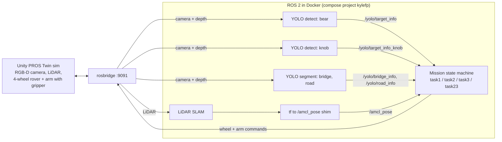
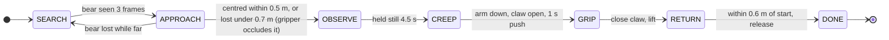
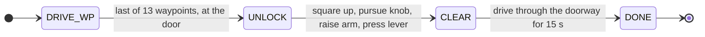

# Final Project - Autonomous Unity Rover Missions

Fully autonomous missions for the PROS Twin Unity rover: no Foxglove clicking and no keyboard driving.
Each task is a hands-free state machine, and all three run against one shared live stack.

- **Task 1 (bear):** search for a bear, approach and hold still in front of it, scoop it up with the arm, and drive back to the start pose.
  Out is reactive visual servoing on YOLO + depth; back is go-to-point on the SLAM pose.
- **Task 2 (bridge + bear):** follow measured waypoints onto the bridge, climb steering on the bear or the bridge segmentation mask, grab the bear at the top, descend steering on the bridge/road masks, then detour around the bridge back to the start and release.
  The bridge section is vision-only, because the SLAM pose freezes on the bridge.
- **Task 3 (door knob):** follow measured waypoints to the door, square up to it, pursue the knob with the camera, raise the arm and press the lever, then drive straight through the doorway.

All perception (bear, knob, bridge/road segmentation) runs at once, so any task can run in any order without restarting containers.

## How it works



The detector and segmenter are the models trained in [HW4](../HW4/README.md).
Each mission ticks at 10 Hz and publishes raw wheel speeds (`car_C_rear_wheel`, `car_C_front_wheel`) and arm joint targets (`robot_arm`).

### Task state machines

These follow the code in `workspace/pros/pros_car/src/pros_car_py/pros_car_py/taskN_mission.py`.
Every task also ends in `DONE` on its safety timeout.

**Task 1 - bear** (`task1_mission.py`)



**Task 2 - bridge and bear** (`task2_mission.py`)

```mermaid
stateDiagram-v2
  direction LR
  [*] --> BRIDGE_APPROACH
  BRIDGE_APPROACH --> VISUAL_CLIMB: last of 10 waypoints
  VISUAL_CLIMB --> OBSERVE: 3 s climb, steering on bear or bridge mask
  OBSERVE --> GRIP: facing the bear, held 2 s
  GRIP --> SNAP_DESCEND: push forward, close claw
  SNAP_DESCEND --> DESCEND: centred on bridge or road mask
  DESCEND --> RETURN: off the bridge (masks gone or road fills view)
  RETURN --> DONE: detour around bridge, within 0.4 m of start, release
  DONE --> [*]
```



**Task 3 - door knob** (`task3_mission.py`)



The combined demo (`task23_auto`, `combined_mission.py`) runs Task 2 to completion, waits 2 s, then runs Task 3.

---

## Quick start - recommended demo (Task 2 + Task 3 in one run)

Three commands. `run_task23.sh` runs the **full Task 2 then the full Task 3 back-to-back** in a single
session, scoring all points from both - this is the demo to watch.

```bash
cd ~/Desktop/Robot-navigation-projects/Final_Project

# 1. Bring up the whole stack (Unity + all ROS 2 containers), detached. Only needed
#    once per boot - skip if the stack is already up.
./start_stack.sh

# 2. With the car at spawn, pin the map frame so the absolute waypoints line up.
#    Run ONCE before the mission.
./tools/reset_map.sh --pin

# 3. Run the combined Task 2 -> Task 3 demo (headless, live state log in this terminal).
./workspace/pros/pros_car/run_task23.sh
```

**Between step 1 and step 2, connect Unity** (on the Chrome Remote Desktop, display `:20`):
log in → **FINAL PROJECT** → set **CAR & ARM Mode = AI** → **RosBridge PORT = 9091** → press
**Reload** (must show **"Connected"**). Nothing publishes until Unity is connected in AI mode.

That's it. Watch the `[combined]` / `[Task2]` / `[Task3]` transitions scroll by. **Ctrl-C** stops the
mission; to retry, re-run `reset_map.sh --pin` (fresh scene, car back at spawn) then `run_task23.sh`.

### What each step does

| Step | Script | What happens |
|---|---|---|
| 1 | `start_stack.sh` | One-shot detached bring-up: the Docker Compose stack (robot + online SLAM + Nav2 + rosbridge on **9091**), all three YOLO containers (bear → `/yolo/target_info`, knob → `/yolo/target_info_knob`, bridge → `/yolo/bridge_info`), the `tf → /amcl_pose` shim, Foxglove (`ws://localhost:8766`), and the Unity sim binary. |
| 2 | `tools/reset_map.sh --pin` | Re-origins odometry and re-anchors SLAM so the spawn point reads `/amcl_pose ≈ (0,0,0)`. Both tasks' absolute waypoints are measured in this pinned frame, so this **must** run (car at spawn) before the mission. Auto-verifies by echoing the spawn pose. |
| 3 | `run_task23.sh` | Builds (incremental) and runs `task23_auto` headless: full Task 2 (mount → climb → grip → descend → return + release) then full Task 3 (drive to door → dock → observe → lever press → drive through). |

---

## Running the tasks individually

Same stack, same `reset_map.sh --pin` ritual. Run any one task instead of the combined demo:

```bash
cd ~/Desktop/Robot-navigation-projects/Final_Project/workspace/pros/pros_car
./run_task1.sh   # bear        (task1_auto)
./run_task2.sh   # bridge+bear (task2_auto)
./run_task3.sh   # door knob   (task3_auto)
```

All three tasks drive on `/amcl_pose` + vision (Task 1's return is a go-to-point on `/amcl_pose`,
not Nav2), so `reset_map.sh --pin` with the car at spawn is the only prerequisite.

---

## Verify it's working (Foxglove `ws://localhost:8766`)

- `/yolo/detection/compressed` boxes the bear/knob; `/yolo/target_marker` sits on the target in 3D.
- `/amcl_pose` is published by the shim and reads ~`(0,0,0)` right after `reset_map.sh --pin`.
- `/map` grows as the rover moves (SLAM).
- The mission terminal prints `[TaskN]` state transitions plus a throttled per-tick sensor readout.

---

## Stopping the stack

The mission is `--rm` (Ctrl-C is enough). To take the **whole stack down** (then close the Unity
window, which is a host process, not a container):

```bash
cd ~/Desktop/Robot-navigation-projects/Final_Project/workspace/pros/pros_car/../pros_app/docker/compose
docker compose -p kylefp \
  -f docker-compose_robot_unity.yml \
  -f docker-compose_slam_unity.yml \
  -f docker-compose_navigation_unity.yml \
  -f docker-compose_perception_unity.yml down
```

---

## Troubleshooting

- **Nothing in `/yolo/*` / camera silent** - Unity isn't connected in **AI mode on port 9091**.
  Re-check the Unity connect step (must show "Connected"). The YOLO nodes are camera-driven, so no
  Unity feed → no detections.
- **Mission drives to the wrong coordinates** - the map frame drifts every session. Make sure
  `reset_map.sh --pin` was run *with the car at spawn*, and that its echo printed ~`(0,0,0)`.
- **Retry a run** - re-run `reset_map.sh --pin` (switches the scene to a fresh map and returns the car
  to spawn), then the task script. Clicking FINAL PROJECT while already in it does *not* reload.
- **Foxglove shows "no Hz"** - usually normal; it only rates topics something is subscribed to. Open a
  panel on the topic (or `ros2 topic hz` inside a container) to confirm it's publishing.
- **Slow first build** - the build cache persists in named volumes, so the first run after a reboot is
  the slow one. Prime it with one warm-up run before demoing. `NOBUILD=1 ./run_taskN.sh` skips the
  build entirely once an install tree exists (safe only for pure-Python edits).

---

## Stack reference

Isolated Compose project so it can coexist with another stack on the shared GPU box:

| Setting | Value |
|---|---|
| Compose project | `kylefp` (network `kylefp_my_bridge_network`) |
| `ROS_DOMAIN_ID` | `7` |
| rosbridge | host **9091** → container 9090 (Unity connects here) |
| Foxglove | `ws://localhost:8766` |
| Unity display | `:20` (Chrome Remote Desktop), NVIDIA offload |

Per-task state machines and tunables live at the top of each
`workspace/pros/pros_car/src/pros_car_py/pros_car_py/taskN_mission.py`
(`__init__`); the combined run is `combined_mission.py` (`task23_auto`). Each `run_taskN.sh` header
documents its own prereqs and the equivalent raw `docker run` command.
