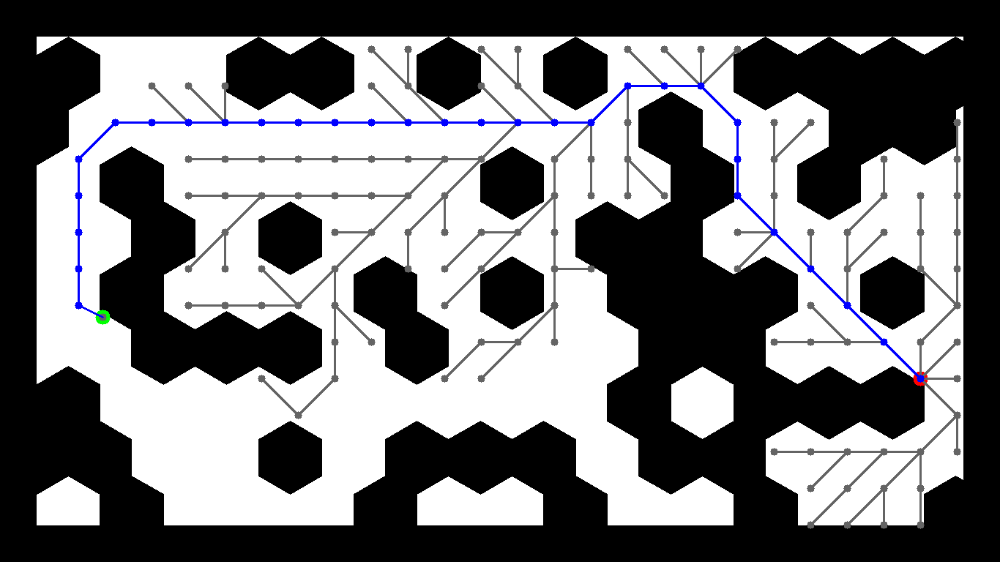
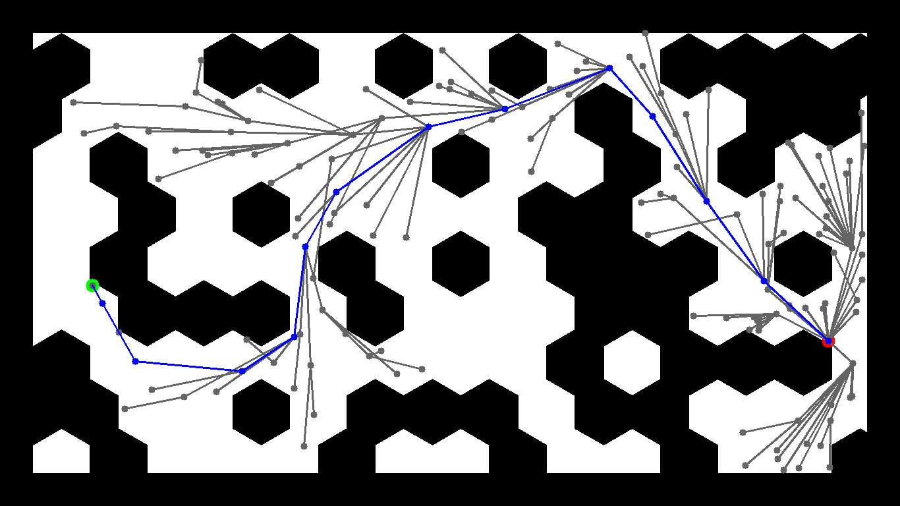
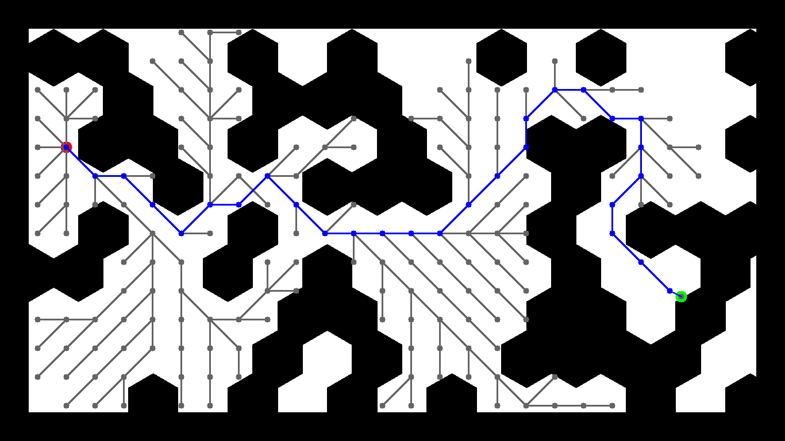
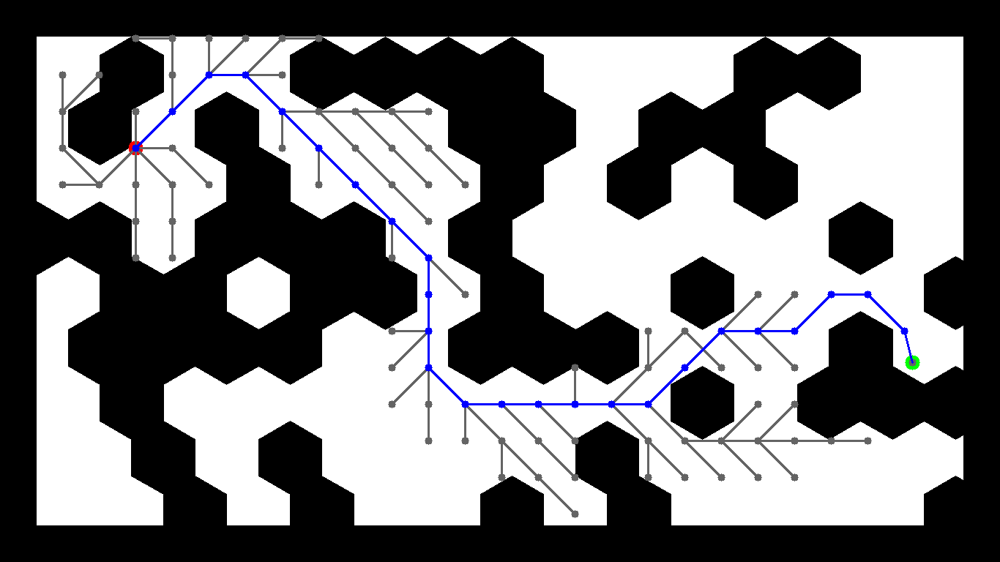
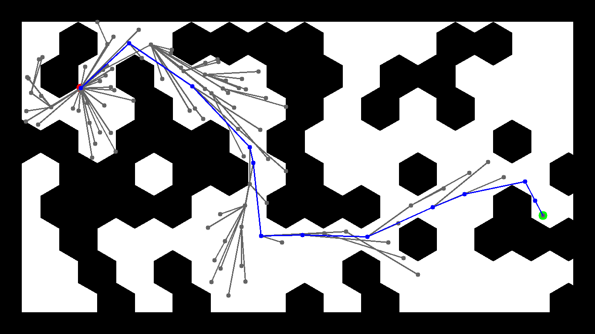

# HW1 - Path Planning

A* and RRT* on three occupancy maps, implemented on top of the course's `preloop` / `step` / `postloop` planner template (`your_implementation/`).

## Results

Blue is the final path, gray is every node the planner explored, and the start and goal are the colored dots.

| Map | A* (50 px grid) | RRT* (50 px step, 200 px rewire radius) |
|---|---|---|
| map1 |  |  |
| map2 |  |  |
| map3 |  |  |

| Map | A* path length | A* nodes explored | RRT* path length | RRT* nodes explored |
|---|---:|---:|---:|---:|
| map1 | 1652 px | 148 | **1617 px** | 152 |
| map2 | 1683 px | 176 | **1540 px** | 655 |
| map3 | 1493 px | 100 | **1443 px** | 102 |

RRT* numbers are one run with the fixed seed in `main.py` (`random.seed(9999)`); across seeds 0-7 its path-length savings over A* range from about 0% to 11%.
A* is optimal on its 8-connected 50 px grid, so its paths are staircases.
RRT* connects nodes at any angle and rewires toward cheaper parents, and in this run its paths are 2-9% shorter.
The cost shows on the cluttered map2: RRT* explores almost 4x as many nodes and runs about two orders of magnitude slower than A* (seconds against tens of milliseconds).

## Method

- **A\*** (`your_implementation/a_star_implementation.py`): heap ordered by `f = g + h` with an L2 heuristic and a closed set; the path is rebuilt by backtracking parent pointers.
- **RRT\*** (`your_implementation/rrt_star_implementation.py`): sample, steer at most one step toward the sample, collision-check, choose the cheapest parent within the search radius, then rewire neighbors through the new node when that lowers their cost.
  The cost is path length plus a wall-clearance penalty `100 / (d + 1)`, where `d` comes from a distance transform of the map, and a 50 px band along the map border is treated as occupied.
  Planning stops at the first node that reaches the goal.

The full write-up is in [`report.md`](report.md).

## Reproduce

```bash
cd HW1
uv venv && uv pip install -r requirements.txt   # also covers the RL/ experiment (torch, gymnasium)
for map in map1 map2 map3; do
  for planner in a_star rrt_star; do
    .venv/bin/python main.py -p $planner -m $map   # writes <map>_<planner>_output.png
  done
done
```

Assignment spec: [`HW1_path_planning.pdf`](HW1_path_planning.pdf).
