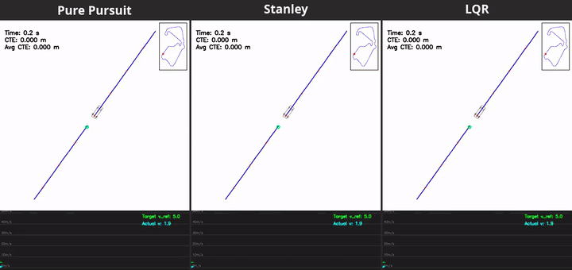
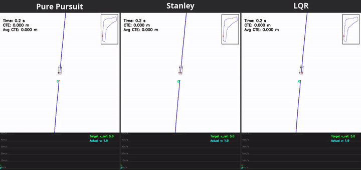

# HW2 - Kinematic Models and Path Tracking Control

A bicycle-model car laps three F1 circuits (Silverstone, Monza, Suzuka), comparing three lateral controllers on the same speed profile.


*Suzuka, 3x speed. Each panel shows the chase camera, a minimap of lap progress, and target vs actual speed. [Full-length mp4](assets/compare_Suzuka.mp4)*

## Method

- **Kinematic models:** basic, differential drive and bicycle (`code/Simulation/`); the results below use the bicycle model.
- **Trajectory generation** (`code/trajectory_generator.py`): natural cubic spline through the track centerline, curvature-limited speed profile (max 85 m/s, 30 m/s² lateral, +12/-18 m/s² longitudinal), and curvature-adaptive waypoint sampling.
- **Longitudinal control:** PID on speed error.
- **Lateral control** (`code/PathTracking/`):
  - **Pure pursuit:** steer toward a look-ahead point at distance `Ld = kp·v + Lfc`, with `kp=0.1`, `Lfc=1`.
  - **Stanley:** heading error plus `atan(kp·e / v)` on the front-axle cross-track error, `kp=2.0`.
  - **LQR:** iterative discrete-time Riccati solution on the linearized 2-state error model (cross-track error, heading error), `Q = I`, `R = I`.

## Results

| Track | Pure pursuit CTE (m) | Stanley CTE (m) | LQR CTE (m) | Lap time (s) |
|---|---:|---:|---:|---:|
| Silverstone | **0.026** | 0.205 | 0.206 | 55.0 - 55.5 |
| Monza | **0.025** | 0.277 | 0.132 | 47.4 - 47.6 |
| Suzuka | **0.032** | 0.222 | 0.207 | 53.2 - 53.8 |
| **Mean** | **0.028** | 0.235 | 0.182 | |

CTE is the average cross-track error over the lap.
All three controllers finish within about half a second of each other, because the shared speed profile sets the lap time; pure pursuit tracks the line almost 10x more tightly.
The tuning sweeps behind these gains are in [`report/report.md`](report/report.md).

## Controller comparison

Each video runs the three controllers side by side, time-synced on the same track.

| Silverstone | Monza |
|---|---|
|  |  |
| [mp4](assets/compare_Silverstone.mp4) | [mp4](assets/compare_Monza.mp4) |

## Reproduce

```bash
cd HW2/code
tracks/fetch_tracks.sh                              # TUM racetrack-database centerlines
uv venv && uv pip install -r ../requirements.txt
for controller in pure_pursuit stanley lqr; do
  for track in Silverstone Monza Suzuka; do
    .venv/bin/python navigation.py -s bicycle -c $controller -t $track   # writes nav_output_*.mp4
  done
done
cd .. && for track in Silverstone Monza Suzuka; do
  PANEL_HEIGHT=540 ../tools/compare_videos.sh \
    "Pure Pursuit=code/nav_output_bicycle_pure_pursuit_${track}_test.mp4" \
    "Stanley=code/nav_output_bicycle_stanley_${track}_test.mp4" \
    "LQR=code/nav_output_bicycle_lqr_${track}_test.mp4" assets/compare_${track}.mp4
  ../tools/make_gif.sh assets/compare_${track}.mp4 assets/compare_${track}.gif 0 "" 720 3
done
```

Assignment spec: [`HW2_Kinematic_Model_and_Path_Tracking_Control.pdf`](HW2_Kinematic_Model_and_Path_Tracking_Control.pdf).
