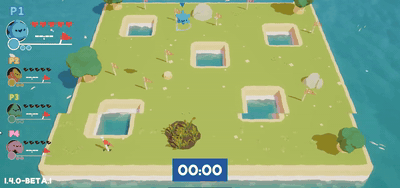
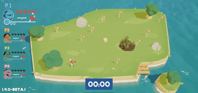
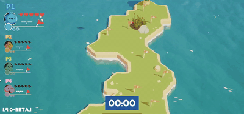
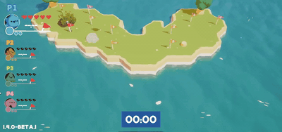
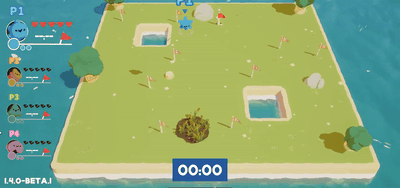

# HW3 - Deep Reinforcement Learning

The showcase is **HW3-2**: a PPO agent that plays *Proly*, a Unity flag-capture game, and collects all 10 flags on each of the five maps.
HW3-1 (PPO path tracking on a kinematic car) lives in [`HW3-1/`](HW3-1/) with its [report](HW3-1/report.md).



*Map 4, "Pothole Island", 4x speed. The agent is the blue player (P1). [Full-speed mp4](assets/proly_map4.mp4)*

## Method

- **Policy:** Stable-Baselines3 PPO, `MlpPolicy` with a `[64, 64]` Tanh network, `n_steps=2048`, driven from the MLGame3D game loop (`HW3-2/rl_play.py`).
- **Reward:** a large capture bonus (+200 per flag), a dense pull toward the next flag, a proximity bonus near the flag, a one-time death penalty, a respawn penalty, a small time penalty, a penalty for nearby hazard terrain, and a tiered penalty for circling in place.
- **Training:** fresh training across maps 0-4, then map shuffling for generalization, then a low-learning-rate fine-tune that cycles between maps 1-3 and map 4 to avoid forgetting.

## Results

Recorded runs of the final `model.zip` (one episode per map, deterministic policy):

| Map | Layout | Flags | Completion time |
|---|---|---:|---:|
| 0 | Island | 10/10 | 27.8 s |
| 1 | S-shaped | 10/10 | 26.2 s |
| 2 | V-shaped | 10/10 | 33.5 s |
| 3 | Two holes | 10/10 | 26.3 s |
| 4 | Pothole Island | 10/10 | 33.0 s |

Every map finishes well inside the 120 s limit.

### Map 4: why a stronger water penalty failed

Map 4 has water potholes in the middle of the island, and the only routes between flags are one-cell corridors between potholes and the shore.
The agent first scored 0/10 there.
Raising the water penalty made it worse: the agent learned that circling in open ground was cheaper than entering a corridor.
The fix was to make circling expensive instead (-1 to a tiered -3/-8) and strengthen the pull toward the flag (distance weight 10 to 15).
Pushing through a corridor then clearly beat circling, and map 4 went to 10/10.
The full derivation is in the [HW3-2 report](HW3-2/report.md) ([PDF](HW3-2/report.pdf)).

## All maps

4x speed; each clip links to the full-speed mp4.

| Map 0 - Island | Map 1 - S-shaped | Map 2 - V-shaped |
|---|---|---|
|  |  |  |
| [mp4](assets/proly_map0.mp4) | [mp4](assets/proly_map1.mp4) | [mp4](assets/proly_map2.mp4) |
| **Map 3 - Two holes** | **Map 4 - Pothole Island** | |
|  |  | |
| [mp4](assets/proly_map3.mp4) | [mp4](assets/proly_map4.mp4) | |

## Reproduce

The Proly build (`Proly.x86_64`, `Proly_Data/`, `UnityPlayer.so`) and the trained `model.zip` are git-ignored; place them in `HW3-2/` first.

```bash
cd HW3/HW3-2
# Play one episode on map 4 with the trained agent (other three players hidden).
CUDA_VISIBLE_DEVICES="" uv run --project .. python -m mlgame3d -w 1 \
  -i model_play.py -i hidden -i hidden -i hidden -e 1 \
  -gp items 0 -gp audio false -gp checkpoint 10 -gp max_time 120 -gp map 4 \
  Proly.x86_64

# Evaluate every map, 3 episodes each (the grading format).
./eval_all_maps.sh

# Record the game window while an episode runs (display :20 by default).
../../tools/record_screen.sh map4.mp4 60 Proly
```

Submitted reports: [HW3-1](HW3_111030034/HW3-1/report_111030034.pdf), [HW3-2](HW3_111030034/HW3-2/report_111030034.pdf).
Assignment slides: [`HW3.pdf`](HW3.pdf).
