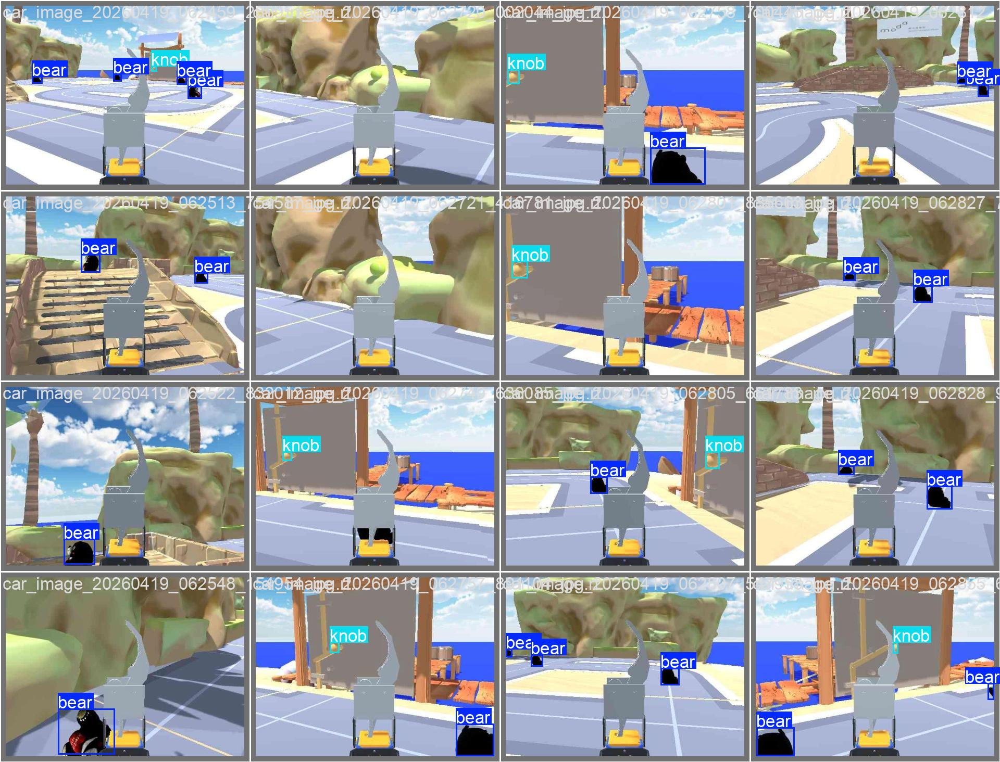
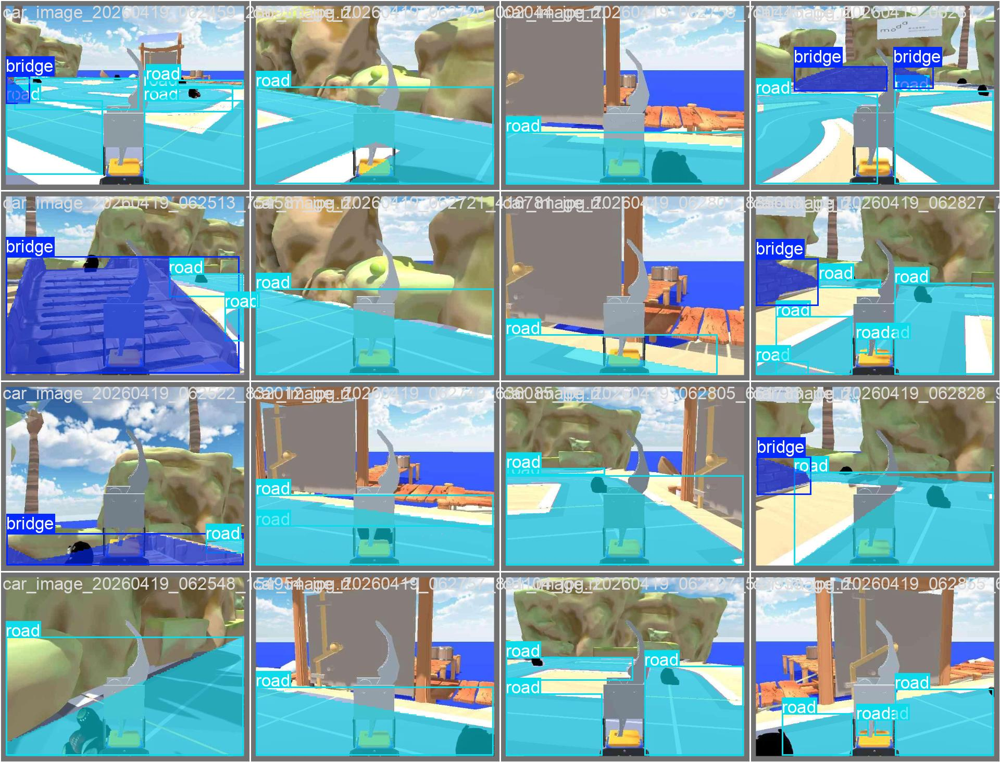
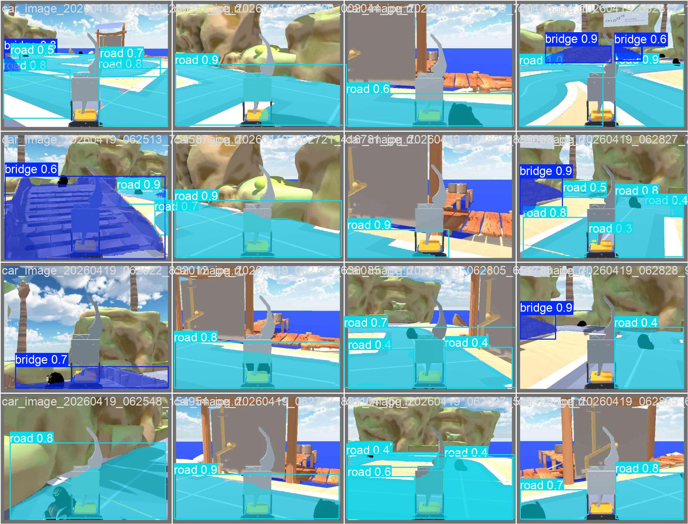
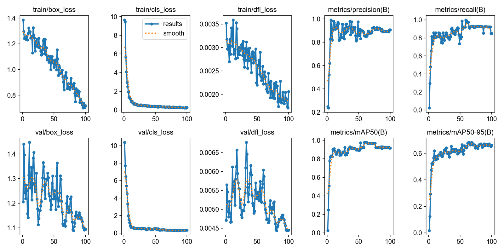
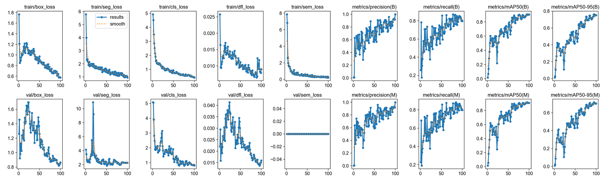
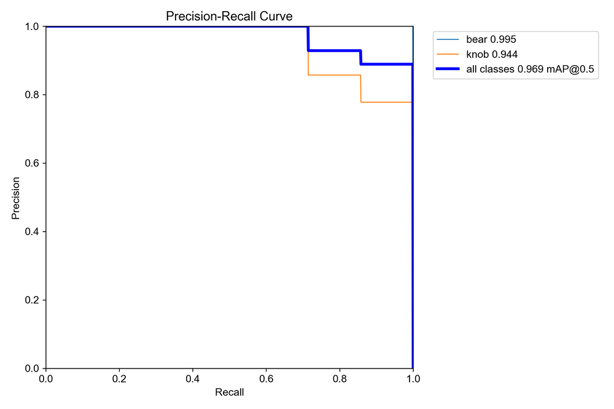
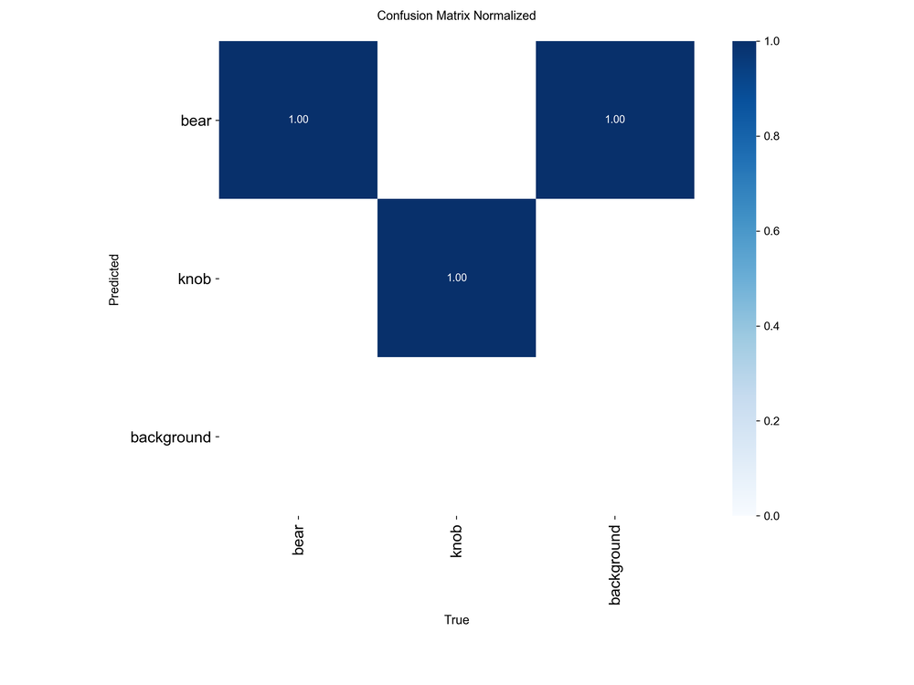
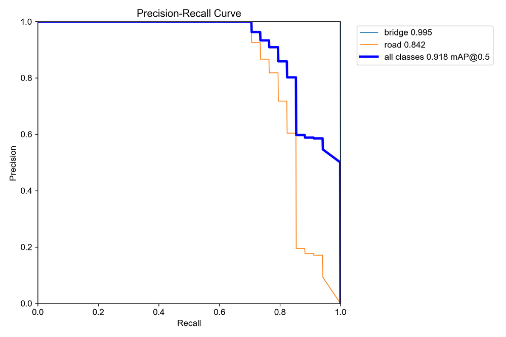
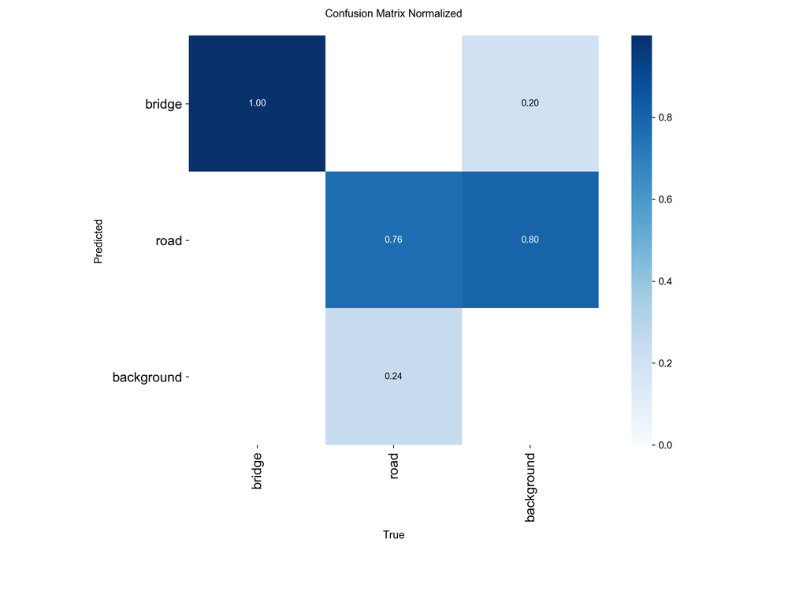

# HW4 - Object Detection and Instance Segmentation

Two YOLO26s models trained on 106 hand-labeled frames from the PROS Twin Unity simulator: a detector for `bear` and `knob`, and an instance segmenter for `road` and `bridge`.
The same detector weights drive the Final Project's bear search.


## Results

Validation split (16 images), evaluated with the `best.pt` weights:

| Model | Class | Precision | Recall | mAP@0.5 | mAP@0.5:0.95 |
|---|---|---:|---:|---:|---:|
| Detection | bear | 0.996 | 1.000 | 0.995 | 0.747 |
| Detection | knob | 0.849 | 0.857 | 0.944 | 0.599 |
| Detection | **all** | 0.923 | 0.929 | **0.969** | 0.673 |
| Segmentation (mask) | bridge | 0.934 | 1.000 | 0.995 | 0.842 |
| Segmentation (mask) | road | 0.956 | 0.706 | 0.850 | 0.563 |
| Segmentation (mask) | **all** | 0.945 | 0.853 | **0.923** | 0.702 |

The `knob` is small in most frames, which shows up as the lowest box mAP@0.5:0.95.
`road` recall (0.71) is the weakest segmentation number: the model misses some road instances entirely.

### Validation predictions

| Ground truth | Prediction |
|---|---|
|  |  |
|  |  |

### Training curves

**Detection**



**Segmentation**



| Detection PR curve | Detection confusion matrix |
|---|---|
|  |  |
| **Segmentation mask PR curve** | **Segmentation confusion matrix** |
|  |  |

Dataset, training configuration and the Final Project navigation plan are in [`report.md`](report.md) ([PDF](report.pdf)).

## Reproduce the metrics

```bash
cd HW4
uv venv && uv pip install ultralytics
python3 scripts/prepare_data.py                     # build train/valid splits from the Roboflow zips
.venv/bin/yolo val model=detection/runs/detect/train/weights/best.pt data=detection/data/data.yaml
.venv/bin/yolo val model=segmentation/runs/segment/train/weights/best.pt data=segmentation/data/data.yaml
```

The datasets and weights are not committed; the Roboflow projects are linked in the report.

---

The rest of this README is the working guide for the simulator, data collection and training.

## Quick Start

### 1. Launch PROS Twin Simulator

Force NVIDIA GPU rendering (required — Chrome Remote Desktop defaults to software rendering):

```bash
cd ~/Desktop/Robot-navigation-projects/HW4/pros_twin_linux/pros_twin_unity_linux/
__NV_PRIME_RENDER_OFFLOAD=1 \
__GLX_VENDOR_LIBRARY_NAME=nvidia \
__VK_LAYER_NV_optimus=NVIDIA_only \
./pros_twin_unity_tsai_run_linux.x86_64 -force-vulkan
```

Verify the GPU is being used (in another terminal while PROS Twin is running):
```bash
nvidia-smi --query-compute-apps=pid,process_name,used_memory --format=csv
# Should list pros_twin_unity_tsai_run_linux
```

Login with your class username and key, then:

1. Select **EASY** mode
2. Choose **FINAL PROJECT** scene (may take a moment to load)
3. Switch from **MANUAL** (Unity) to **AI** (ROS) mode

Controls in the simulator:
- Right mouse button: change view direction
- WASD keys: move viewpoint
- Mouse wheel: zoom in/out
- Click "FINAL PROJECT" tab to reset the scene (randomly regenerated)
- LiDAR visualization can be toggled off under SETTINGS > Render > Lidar

### 2. Launch PROS App (Terminal 1)

```bash
cd ~/Desktop/Robot-navigation-projects/HW4/workspace/pros/pros_app/
python3 ./control.py -s
# Select "slam_unity.sh"
# Keep this terminal open
```

### 3. Launch Foxglove

Open https://app.foxglove.dev in Chrome, then:

1. Click **Open connection**
2. Select **Rosbridge**
3. Enter URL: `ws://localhost:9090`
4. Click **Open**

You should see the car's camera feed (depth + RGB).

### 4. Collect Data (Terminal 2)

```bash
cd ~/Desktop/Robot-navigation-projects/HW4/workspace/pros/pros_car/
./car_control.sh
r
ros2 run pros_car_py robot_control
# Select "Manual Arm Control"
# Select "[0]"
# Press b to reset the car position
# Press q to quit arm control
# Select "Control Vehicle"
```

Vehicle controls:
| Key | Action |
|-----|--------|
| w | Forward |
| s | Backward |
| e | Turn left |
| r | Turn right |
| z | Stop |
| c | **Save current image** |
| q | Quit |

Images are saved to `HW4/workspace/pros/pros_car/src/pros_car_py/images/`

Speed config: `HW4/workspace/pros/pros_car/src/pros_car_py/pros_car_py/ros_communicator_config.py`

## Data Labeling (Roboflow)

Go to https://roboflow.com/ and create **two** projects (use random names for anti-plagiarism):

| Project | Type | Classes |
|---------|------|---------|
| Detection | Object Detection | `bear`, `knob` |
| Segmentation | Instance Segmentation | `road`, `bridge` |

Steps per project:
1. Create Project > set visibility to **Public**
2. Define classes under **Classes & Tags**
3. Upload images via **Upload Data**
4. **Annotate** > Label Myself
   - Detection: draw bounding boxes
   - Segmentation: draw polygon areas (or use auto-labeling)
   - If no target object in image, mark as null
5. Add annotated images to dataset (assign to train/valid/test)
6. **Versions** > remove Auto-Orient and Resize preprocessing > skip Augmentation > **Create**
7. **Download Dataset** > format: **YOLO26** > Download zip

## Training

### Directory Structure

```
HW4/
  detection/
    data/
      train/images/  train/labels/
      valid/images/  valid/labels/
      test/images/   test/labels/
      data.yaml      # change paths to ABSOLUTE paths
    train.py
  segmentation/
    data/
      ...same structure...
      data.yaml
    train.py
```

### data.yaml - Fix Paths

Change relative paths to absolute:
```yaml
train: /home/kyle/Desktop/Robot-navigation-projects/HW4/detection/data/train/images
val: /home/kyle/Desktop/Robot-navigation-projects/HW4/detection/data/valid/images
test: /home/kyle/Desktop/Robot-navigation-projects/HW4/detection/data/test/images
```

### train.py

```python
from ultralytics import YOLO

if __name__ == "__main__":
    # Detection: yolo26n.pt, yolo26s.pt, ...
    # Segmentation: yolo26n-seg.pt, yolo26s-seg.pt, ...
    model = YOLO("yolo26n.pt")
    model.train(data="data/data.yaml", epochs=100, batch=8)
```

Run:
```bash
cd detection && python train.py
# Best weights saved to: detection/runs/detect/train/weights/best.pt
```

## Testing with ROS

1. Copy your `.pt` model to:
   `HW4/workspace/pros/ros2_yolo_integration/src/yolo_example_pkg/models/`
2. Edit model path at line 26 of:
   `HW4/workspace/pros/ros2_yolo_integration/src/yolo_example_pkg/yolo_example_pkg/object_detect.py`
3. Run:
   ```bash
   cd HW4/workspace/pros/ros2_yolo_integration/
   ./yolo_activate.sh
   r
   ros2 run yolo_example_pkg yolo_node
   ```
4. View results in Foxglove

## Submission

**Deadline: 2026/05/03 23:59** (no late submissions)

File: `{studentID}_HW4.zip` containing:

| File | Description |
|------|-------------|
| `detection.pt` | Trained object detection model |
| `segmentation.pt` | Trained segmentation model |
| `detection.mp4` | 30-60s Foxglove demo video |
| `segmentation.mp4` | 30-60s Foxglove demo video |
| `report.pdf` | Report (English or Mandarin) |

10 points deducted per missing file or incorrect filename.

### Report Contents
- Two Roboflow project links
- Dataset config (# images, categories, train/test split, augmentation)
- YOLO training config (model type, # epochs)
- Description of dataset diversity (text + example images)
- Navigation strategy for the final project (text, figures, algorithm)

## Grading

| Component | Weight |
|-----------|--------|
| Object Detection - Bear | 20% |
| Object Detection - Knob | 20% |
| Object Detection - Quality | 5% |
| Semantic Segmentation - Road | 20% |
| Semantic Segmentation - Bridge | 20% |
| Semantic Segmentation - Quality | 5% |
| Report | 10% |
