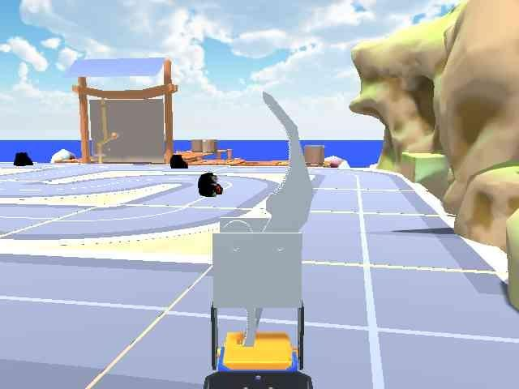
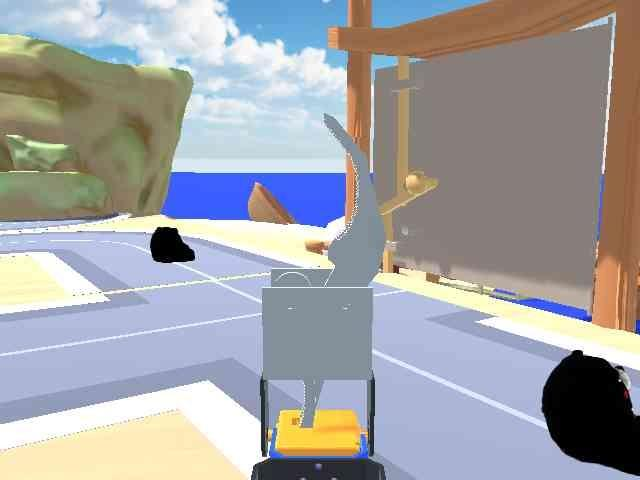
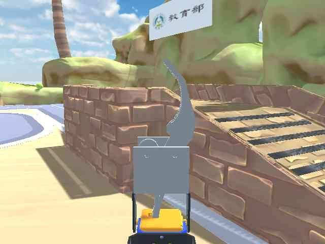

# HW4 Report 111030034 工學院學士班 陳安楷
## 1. Roboflow Project Links

| Task | Link |
|------|------|
| Object Detection (`bear`, `knob`) | [Open on Roboflow Universe](https://universe.roboflow.com/kyles-workspace-abat6/1273890ajkdlf-l32ou98pdet) |
| Instance Segmentation (`road`, `bridge`) | [Open on Roboflow Universe](https://universe.roboflow.com/kyles-workspace-abat6/138u479ojsdlk-fjawseg) |

Both projects are set to **Public** visibility. Annotations were drawn manually (bounding boxes for detection, polygons for segmentation). Images with no target objects were marked as null.

## 2. Dataset Configuration

| Property | Detection | Segmentation |
|----------|-----------|--------------|
| Total images | 106 | 106 |
| Classes | `bear`, `knob` | `road`, `bridge` |
| Train / Val split | 90 / 16 | 90 / 16 |
| Test set | held out from Roboflow split | held out from Roboflow split |
| Preprocessing | Auto-Orient and Resize **disabled** | Auto-Orient and Resize **disabled** |
| Augmentation (Roboflow) | none (skipped) | none (skipped) |
| Augmentation (Ultralytics, train-time) | mosaic, fliplr=0.5, HSV(H=0.015, S=0.7, V=0.4), randaugment, erasing=0.4 | same |
| Export format | YOLO26 | YOLO26 |

All Roboflow preprocessing/augmentation was intentionally turned off so that the training-time augmentation pipeline (handled by Ultralytics) is the single source of variation. This avoids stacking two augmentation pipelines in series, which can over-distort small datasets.

## 3. YOLO Training Configuration

Both models share the same hyperparameters; only the backbone weights differ.

| Hyperparameter | Detection | Segmentation |
|---|---|---|
| Pretrained weights | `yolo26s.pt` | `yolo26s-seg.pt` |
| Task | object detection | instance segmentation |
| Epochs | 100 | 100 |
| Batch size | 16 | 16 |
| Image size | 640 × 640 | 640 × 640 |
| Optimizer | AdamW (auto-selected) | AdamW (auto-selected) |
| Initial LR (`lr0`) | 0.01 | 0.01 |
| Final LR factor (`lrf`) | 0.01 | 0.01 |
| Momentum | 0.937 | 0.937 |
| Weight decay | 5e-4 | 5e-4 |
| Warmup epochs | 3.0 | 3.0 |
| Device | GPU 0 | GPU 0 |
| Mask ratio | — | 4 |
| Overlap mask | — | enabled |


### Final epoch metrics (epoch 100/100)

**Detection**

| Precision | Recall | mAP@0.5 | mAP@0.5:0.95 |
|---|---|---|---|
| 0.906 | 0.850 | 0.918 | 0.660 |

**Segmentation**

| Output | Precision | Recall | mAP@0.5 | mAP@0.5:0.95 |
|---|---|---|---|---|
| Box (B) | 1.000 | 0.797 | 0.904 | 0.751 |
| Mask (M) | 1.000 | 0.797 | 0.910 | 0.704 |

## 4. Dataset Diversity

Images for both tasks were captured **from many angles, distances, and viewpoints** rather than from a single canonical pose. Concretely, the car was driven around each target object (and along each road/bridge segment) and the `c` key was used to dump a frame at each pose.

### Why this matters for generalization

A small dataset (n = 106) is at high risk of **overfitting**: the model can memorize the few training views and fail when the test view is even slightly different. Diversity at capture time is the cheapest and most effective defense, for three reasons:

1. **Better coverage of the appearance manifold.** A "bear" looks very different from above, from the side, in front of the knob, far away, etc. The space of possible views is a high-dimensional manifold. With only 106 images we cannot densely sample it, but capturing from varied angles and distances ensures the **support** of our training distribution is wide rather than peaked. The model's empirical risk minimum then approximates the true risk over a larger fraction of the deployment distribution.

2. **Breaking spurious shortcut features.** If every "bear" image is taken from the same angle with the same lighting, the model can latch onto a shortcut feature — say, a particular shadow on the bridge — and use *that* to classify, rather than the bear's actual shape. Diverse capture forces the gradient to push the network toward features that are **invariant** across viewpoint and distance, which are the features that actually generalize.

3. **Implicit regularization.** Diverse natural views act as a form of data augmentation that no synthetic transform can fully reproduce (perspective changes, occlusion patterns, scale-dependent texture). This effectively raises the entropy of the training set and reduces the model's tendency to fit noise. Combined with Ultralytics' train-time mosaic / HSV / fliplr / randaugment / erasing pipeline, the network sees a much larger effective dataset than the raw count would suggest, which is reflected in the strong validation mAP (0.918 detection / 0.910 mask) achieved on only 16 validation images.

### Example captures

**Detection — `bear` and `knob` from varied angles/distances**

| Far view | Close / oblique view |
|:---:|:---:|
|  |  |

**Segmentation — `road` and `bridge` from varied positions**

| Near / on-road perspective | Far / approach view |
|:---:|:---:|
|  |  |

## 5. Navigation Strategy for the Final Project

### 5.1 Vehicle kinematics

The PROS Twin car is a **4-wheel differential drive (skid-steer)** platform. The wheel-velocity command is a 4-element array

```
[ v_RL,  v_RR,  v_FL,  v_FR ]
```

published over the topics `/car_C_rear_wheel` and `/car_C_front_wheel` (see [ros_communicator_config.py:10-59](workspace/pros/pros_car/src/pros_car_py/pros_car_py/ros_communicator_config.py#L10-L59)). Treating the left side as `v_L = v_RL = v_FL` and the right side as `v_R = v_RR = v_FR`, the body-frame kinematics reduce to standard differential drive:

$$
v \;=\; \frac{v_L + v_R}{2}, \qquad \omega \;=\; \frac{v_R - v_L}{W}
$$

where `v` is forward linear velocity, `ω` is yaw rate, and `W` is the effective track width.

### 5.2 Available motion primitives

From the manual control mapping (`car_controller.py:62-75`), the discrete primitives exposed to the keyboard interface are:

| Primitive | Wheel pattern | `v` | `ω` |
|---|---|---|---|
| `FORWARD` (w) | `[+v, +v, +v, +v]` | > 0 | 0 |
| `BACKWARD` (s) | `[−v, −v, −v, −v]` | < 0 | 0 |
| `COUNTERCLOCKWISE_ROTATION` (e) | `[−v, +v, −v, +v]` | 0 | > 0 |
| `CLOCKWISE_ROTATION` (r) | `[+v, −v, +v, −v]` | 0 | < 0 |
| `LEFT_FRONT` (a) | `[v, 1.2v, v, 1.2v]` | > 0 | > 0 |
| `RIGHT_FRONT` (d) | `[1.2v, v, 1.2v, v]` | > 0 | < 0 |
| `STOP` (z) | `[0, 0, 0, 0]` | 0 | 0 |


### 5.3 Strategy

The plan is a perception → decision → action loop running on each new RGB frame:

1. **Perception.** Run the YOLO detector on the live camera feed to localize `bear` (current goal) and `knob`. In parallel, run the segmentation model to obtain a binary mask of `road ∪ bridge` — the **drivable region**.
2. **Goal selection.** If a `bear` is detected, pick its bounding-box centroid as the target. Otherwise default to the centerline of the drivable mask (the column-mean of the mask in the lower half of the frame), so the car always makes forward progress along the road.
3. **Lateral error.** Compute the horizontal pixel offset `Δx = x_target − x_image_center`, normalized by image width.
4. **Action policy.** Map `Δx` to a motion primitive with hysteresis thresholds:
   - `|Δx| < ε_align` → `FORWARD`
   - `ε_align ≤ |Δx| < ε_arc` → `LEFT_FRONT` / `RIGHT_FRONT` (smooth arc steering for path following)
   - `|Δx| ≥ ε_arc` → `COUNTERCLOCKWISE_ROTATION` / `CLOCKWISE_ROTATION` (in-place rotate to re-acquire heading)
   - target reached (bbox area > threshold and centered) → `STOP`
5. **Obstacle handling.** If a `knob` bounding box overlaps the drivable mask near the bottom of the frame, override the policy with `STOP` followed by an in-place rotation toward the larger drivable side, then resume.

## 6. Discussion
This project serves as a warmup for final project. The hardest part isn't yolo training, but labelling and environment construction. The default config can easily reach 0.8 mAP50, but labelling 100 images for both models took me four days. All in all, it's my first time using Unity with ros2 and I really enjoyed it. Thank you TA for creating this fun project!
