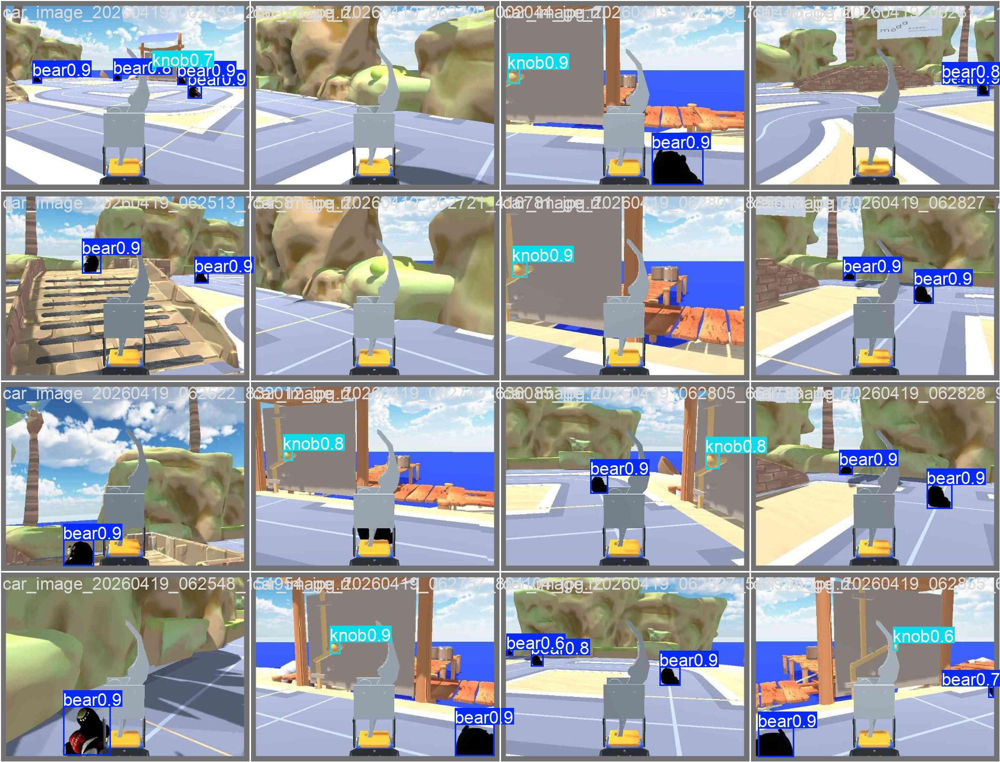

# Robot Navigation and Exploration

Coursework for NTHU's Robotic Navigation and Exploration (spring 2026): classical planning and control, deep reinforcement learning, perception, and a fully autonomous rover in a Unity simulator.
Each folder has its own README with results and exact commands to reproduce them.

| | Assignment | Highlights |
|---|---|---|
|  | **[HW1 - Path planning](HW1/README.md)**<br>A* and RRT* on three occupancy maps | RRT* finds 2-9% shorter paths than grid A*, at up to 4x the explored nodes |
|  | **[HW2 - Path tracking control](HW2/README.md)**<br>Pure pursuit, Stanley and LQR on a bicycle model around three F1 circuits | Tuned pure pursuit holds 0.03 m average cross-track error, 6-8x tighter than LQR and Stanley |
|  | **[HW3 - Deep RL](HW3/README.md)**<br>PPO agent for the Unity game *Proly* | 10/10 flags on all five maps; reward rebalancing fixed the map that started at 0/10 |
|  | **[HW4 - Detection and segmentation](HW4/README.md)**<br>YOLO26s trained on 106 hand-labeled sim frames | 0.97 detection mAP50 (bear, knob), 0.92 mask mAP50 (bridge, road) |
| | **[Final Project - Autonomous rover](Final_Project/README.md)**<br>ROS 2 + SLAM + YOLO state machines for three Unity missions | Grab a bear, cross a bridge to fetch another, and open a door, all hands-free |

## Layout

```
HW1/            A* / RRT* planners (+ RL/: PPO navigation experiment)
HW2/            kinematic models, speed profile, pure pursuit / Stanley / LQR
HW3/            HW3-1 PPO path tracking, HW3-2 PPO agent for Proly
HW4/            YOLO detection + segmentation training and the ROS 2 inference nodes
Final_Project/  Docker Compose ROS 2 stack and the per-task mission state machines
tools/          helpers for README media (GIFs, comparison videos, screen recording, link check)
```

## Environment

- Python projects use [uv](https://docs.astral.sh/uv/): `uv venv && uv pip install -r requirements.txt` in HW1 and HW2, and `uv run --project HW3` for HW3.
- HW4 and the Final Project run ROS 2 Humble in Docker; see their READMEs for the stack.
- The Unity simulators (PROS Twin, Proly), trained weights and datasets are large binaries and are git-ignored.
  They come from the course materials.
